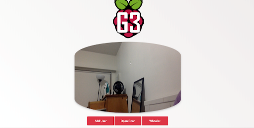
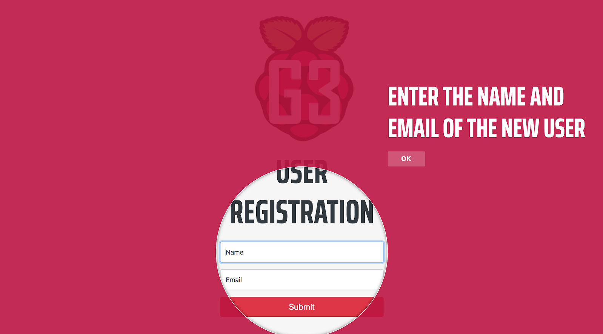
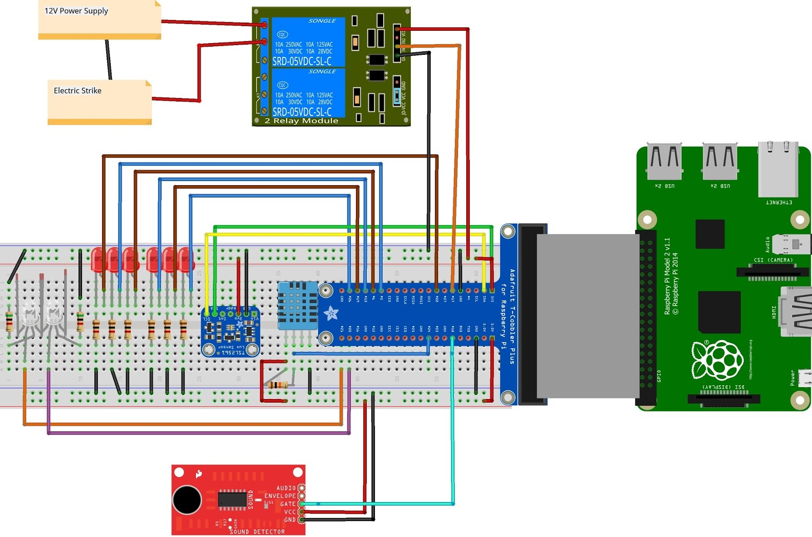

  

<h1 align="center"> SmartHome-Door </h1>

  A smart home with a twist

 

# :pushpin: TL;DR
# :camera: Sneak Peak
### :post_office: Smart Home Prototype:

  
  

 

### :iphone: Mobile App:

  
  
  
  
  
  

 

### :globe_with_meridians: Web App:

  
  
  
  
  
    

 

# :bulb: Introduction
# :gear: System Diagrams
## Hardware:

  

 

  

 

## Software:

  

 

# :books: Description

  

 

The implementation of smart home product is divided into two parts, hardware and software. In general, hardware part is used to collect data about temperature, humidity and light level inside and outside the home and detect the sound control and facial recognition to control the door of the smart home. While software part is to analyse the collected data, graphing the data, sending control back to hardware. Specifically, facial recognition uses camera to recognize the face of the user. If it is whom the host wants to open the door for, the door would be unlocked. If it is not, the door would be still locked. In addition, a secret lock is set for whom is not on the list and still want to open the door. 

## Hardware:
Our hardware includes a wooden model of a house with a door and two rooms. The door has a lock with an electric strike. The door unlocks when the webcam attached to the door recognises an authorised face. The tiny house has 4 sensors inside, which are separately used to sense the ambient temperature, humidity and light level inside the room. The hardware components are in the following.
Wooden model of a house: A tiny home is built to hold all the components relative to the project and exhibit the implementation of this project. The most significant part is the door that is implemented with facial recognition security system. We built the home using 4 pieces of wood cut from a 2” by 4” lumber. Each is around 14 cm long. Then 5 pieces of hardboard are screwed onto the wood as the walls, and the bottom. 

* Raspberry pi: The pi collects data from sensors, camera, webpage and Android app. It will then pass the ambient temperature, humidity and light level to MySQL database and analyse the facial image from the camera if it gets the signal of motion sensor. If the facial image is authorised, the pi will send signal to the relay to give electricity to the strike to unlock the door. We implemented the headless control to reduce the troubles caused by the need of keypad and mouse for connection. 

* Electric strike: We read the datasheet and knew it would need 12V to power the strike. We then decided to use a power adaptor provide electricity. The electric strike is controlled by the relay. If the relay gives electricity to the strike, the strike will be unlocked. Otherwise, the strike will be still locked. The strike is secured with 2 pieces of wood above and under it. 

* Camera:  A camera is used to implement facial recognition which takes the image of user in front of the door and send these information to the pi. It is being clipped at the door. 

* Speaker: It provides voice feedback at the door. It is used for playing housewarming music when an authorized person is detected at the door. It also gives out a message “Welcome home…” It is connected to the pi and being placed inside the house. 

* Relay: This is to provide electricity to the strike (to unlock it) depending on the signal received from the pi. 

* Sensors: 
  * Humidity sensor(DHT11): to sense the ambient humidity and temperature. It is being placed inside the house. Data will then be sent to the pi.  

  * Lux sensor(TSL2561): to sense the ambient light level and send the data to the pi. It is placed inside the house. 
  
  * PIR Motion sensor (189): to sense the object in its specific range. If it is, it sends signal to the pi. The pi would turn the camera on to start the facial recognition. It is clipped at the door facing upwards. 

  * Sound sensor (SEN-12642): to sense high and low frequency around it. We used it for recognising the secret knock to open the door. 

## Software:

### Entire Project breakdown:
* Frontend : 
  * Html , CSS, Javascript
  * Bootstrap , Multiple online templates from codepen.io
  * Chart.js , Vis.js , Jquery , material-walkthrough.js  
* Backend:
  * LAMP framework: Linux Apache MySQL PHP
  * Python and Flask(Facial recognition part)

### Facial Recognition:
#### Hardware:

  

 

  

 

#### Implementation:
* We decided not to use an API to implement facial recognition. We instead decided to pursue our own implementation of facial recognition. Although it was significantly more difficult, time consuming, and required larger computational power. This decision was made as we found the flexibility and personalization our own implementation provides to be superior than most face recognition APIs that basically provide a plug and play functionality, with minimal customization and controllability 

* However, writing code for everything from scratch would have been impossible due to the complexity required for image processing, so we decided to use OpenCV framework and pythons facial_recognition library to help with that.

* We decided to use python because of its high flexibility and convenience and also the relatively easier frontend frameworks available such as flask.
A prior implementation was using C# for backend and xaml for frontend, along with Microsoft API for facial recognition, but as mentioned above, the lack of personalization pushed us away from that implementation, although it would have been relatively easier.

* We used pythons pygame and Google’s text to speech conversion to give voice feedback through the speaker, so that the person on the door knows when the door is opening, when its closing, and when they are authorised for entry.

#### Graphical User Interface:
* For developing a graphical user interface to allow clients to control their facial recognition door functionalities we decided to use Flask framework, as it allows easy integration between the python backend, and the HTML frontend. 

* We then Used bootstrap, CSS to style our HTML pages to make them presentable.

* Although it had a relatively steep learning curve,at the end of the day Flask was very convenient to use.

* It allowed us to write python code for each html page to be shown in the GUI, and it was particularly convenient in redirecting between pages and handling requests processed on each page.

#### Further Details:

  
   
  
  
  

 

* This page has a live webcam feed that worked by continuously yielding pictures from the webcam and showing them on the website after validating them, thus giving a functional live feed for people to monitor their house.

* It provides the user with 3 buttons that allows him/her to do the following:
  * Open Door
  * Show Whitelisted Users
  * Add a new user
  
### Web/Server:
#### Overview:

  

 
As per the above image , our website/app has full control over the room I/O devices (lights, heaters..). This is done by having the website communicate with the pi that is connected to these I/O devices.

#### Initial Considerations:
Since our entire web server lies on the provided Vling vm, we needed a way to synchronize the pi GPIO and control through a remote, stable method. Our first approach was to have the entire server on the pi creating a tunnel to the vm. However, upon further inspection and considerations we found out that this leads to a lot of breaks upon change of IP and firewall settings. Thus, we have implemented a highly secure, reliable, and scalable method that not only allows quick and impregnable device control but also synchronization across multiple clients (and possibly web-servers) .

#### Methodology:

  

 

As seen above, we have created and fully integrated a MySQL relational database on our vling web server. This database contains multiple smaller databases and tables that store and allow the full functionality of our project. These databases are represented inside the blue box above(Sensor readings , Status flags ..).

Residing on the webserver are multiple control php scripts. These scripts allow the website / Pi to access and control our db. These scripts come in the form of:

* Add_data.php 
* Get_data.php

At any point in time, the pi/website can query the database and edit any of aspect of the db. 
The following table represents the use and functionality of each db/table in our project:
table here

To facilitate the access/query of the database different libraries were used for each of the pi and website/app.
* Pi: using python urllib2 library (creating http requests to correspond script on server) 
* Website:  Jquery ajax (creating http requests to correspond script on server)

#### Details on Web-sync:

  

 

There are 5 main control status flags that control the overall functionality of our system:
* Change-Flag  & isPiCommandDone.:
  * Once the user presses sync-pi button on website/app .
    * A Javascript function running jquery.ajax sends a request to set_changeFlag_true.php (changes status Flag-> Change Flag to true) and starts. 
    * Another  Javascript function running jquery.ajax sends a request to set_piDone_false.php (changes status Flag->isPiCommandDone to false), blocks user input by showing a loading screen and starts a poll waiting for the flag to reset again.
  
  * Pi (Integration.py) detects the change to that flag (By constantly reading the change flag using get_changeFlag_status.php) 
    * Pi then requests the new Gpio status pins  ( in json format) from the buttonStat db by calling the get_button_status.php script.
    * Pi then iterates over the corresponding gpio pins and sets each pin accordingly.
    * Pi then resets both change & piDone flag signifying the website that it successfully set the gpio pins.
  * Since the flags were reset, the initiated polling started in step 1 detects the reset and removes the loading screen.
  
* openDoor:
  * Once user presses “Force Open” door button , a Javascript function running jquery.ajax sends a request to set_openDoor_true.php. And initiates a loading screen.
  * Pi (Integration.py) detects the change to that flag (By constantly reading the flag using get_openDorr_status.php)  and opens door and resets the flag and loading screen back.
  
* reloadStat:
  *This command is run by the Pi when an external I/O device changes any Pin stats (example a push button ) signifying that the website needs to reload the new button statuses. Implemented using a long polling system just like above.
  
* webSync:
  * This command synchronizes the loading screen across all client-platforms (website/app) such that when the app has a loading screen, the website would also show the load too. Thus allowing a full synchronization across all platforms.

#### Temperature/Humidity Graphing Functionality:

  

 

* We created a mySQL database that holds the value of the temperature and humidity that the Raspberry pi updates repeatedly.
* We then created a PHP script that reads the values from the database and prints the data in JSON format.
* Then, we used an Ajax call to get that JSON object which holds all the values of the sensor.
* Then we used this JSON object and plotted a User-friendly graph accordingly using a javascript library called vis.js.
* Finally, we styled the webpage with multiple CSS style sheets.

#### Smart Door Access Timeline Functionality: 

  

 

This feature displays the events, “Access Granted : Person 1”, “Access Denied” and “Door Unlocked “ in a user-friendly timeline.
* First we created a mySQL database that holds the event type and its corresponding date and time.
* We then created a PHP script that reads the values from the database and prints the data in JSON format.
* Then, we used an Ajax call to get that JSON object .
* Then, we used that JSON object to create a timeline using the javascript library called vis.js 
* Then, we styled the webpage using multiple CSS style sheets and also added the photo of the person who is performing the event.

### Android App:
Since we already had a responsive website, thanks to Bootstrap, we just had to modify it slightly to make it fully compatible with the  mobile screen i.e to add buttons etc. After that we used  Android Studio to convert it to a mobile app.
* First we modify the android.manifest.xml file to the give the app internet-permission.
* Then, we create a WebView Object in the main Java file to add the website url and also enable javascript.
* Then we modified the layout to fit the website properly on the screen and also change the app logo.

# :scroll: Appendix

## Pi3 Circuit Diagram:

  

 

## Components List:

|Part #|Description|Quantity used|
| :---: | :---: | :---: |
|N/A   |Raspberry Pi 3   |1|
|DHT-11   |Temperature-humidity Sensor   |1|
|TSL2561   |Digital Luminosity/Lux/Light Sensor   |1|
|55-A   |Electric Strike   |1|
|N/A   |Camera   |1|
|N/A   |RGB LED   |2|
|N/A   |LED   |6|
|189   |PIR Motion Sensor   |1|
|12642   | Sound sensor   |1|

